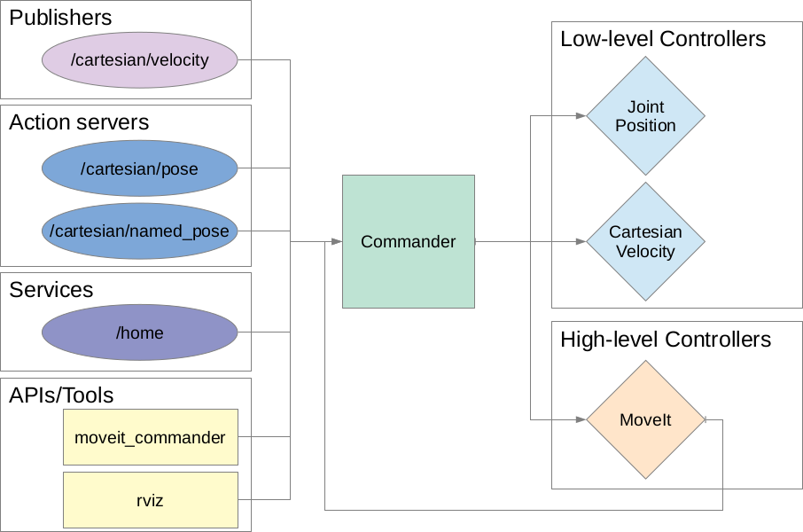

# QUT Manipulation Commander (QMC)

## Overview

The QUT Manipulation Commander (QMC) provides a simple unified mechanism for building high-level interface configurations for seamlessly controlling a broad range of manipulators under different actuation modes.

More concretly, QMC provides a mechanism for advertising high-level topics, services and action_servers for controlling a manipulator, which when called, not only actuate the manipulator based on the provided command, but also hot-swaps in the relevant low-level controllers for that actuation mode. 

Additionally, QMC also provides a convenient mapping to the MoveIt planning framework, and provides controller switching when it receives MoveGoal requests from MoveIt.

An example configuration of QMC can be seen below:



## Setup
QMC configurations are specified using the YAML file format and should be loaded via rosparam into the local namespace of QMC. This configuration defines: 1) a `move_group` name to be used when generating goals with the MoveIt planner, and 2) a list of `controllers` representing of one or more controller descriptions. This format can be seen below. 

```
move_group: move_group_name
controllers:
  - Controller Description 1
  - Controller Description 1
```


#### Controller Description
Each controller description is composed of the following fields:

| Field Name | Description | Example |
| --------| --------| --------|
| topic_name       | Specifies the topic name to which QMC will subscribe. | `"cartesian/velocity"` |
| topic_type       | The topic type of the subscriber. |  `"geometry_msgs/Twist"`  |
| maps (optional)  | The topic name that QMC will republish on to communicate with the activated low-level controller. If left unspecified, QMC will switch controllers but not republish the received message.  | `"/cartesian_velocity_node_controller/cartesian_velocity"` |
| controller | The low-level controller required to achieve the actuation mode described by `topic_name` |  `"cartesian_velocity_node_controller"` |
| type | Specifies whether to advertise a subscriber, service or action_server |  `"subscriber"` |

#### Example Configuration

An example configuration for the Franka-Emika Panda can be seen below:
```
move_group: panda_arm_hand
controllers:
  - name: "cartesian/velocity"
    topic_type: "geometry_msgs/Twist"
    type: "publisher"
    controller: "cartesian_velocity_node_controller"
    maps: "/cartesian_velocity_node_controller/cartesian_velocity"
  - name: "/move_group/goal"
    topic_type: "moveit_msgs/MoveGroupActionGoal"
    type: "publisher"
    controller: "position_joint_trajectory_controller"
```

### Extending QMC
QMC provides basic functionality, but it is often the case that you will need to extend on these capabilities to meet the requirements of a specific manipulator.

For this purpose, QMC provides access to two core interfaces, `manipulation_commander` and `mantipulation_moveit_commander`. 

For an example of how these modules might be extended, see the [qut_panda_driver](https://bitbucket.org/acrv/qut_panda_driver) package. The extension provided in this package provides additional functionality, such as clearing errors on the e-stop being released.

